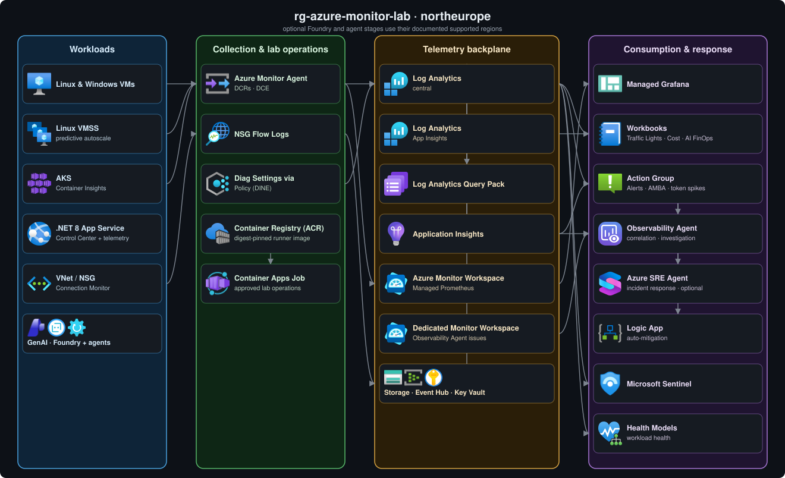

# Azure Monitor Lab

A self-contained demo centered on Azure Monitor, AI, and Azure SRE Agent, with optional Microsoft Sentinel scenarios. Everything runs from a single config file that stays out of git, so you can stand the whole thing up in your own subscription and tear it back down when you're finished.

- One resource group: the whole lab lands in `rg-azure-monitor-lab`.
- Two ways to deploy it: Bicep or Terraform.
- Three ways to run it: a single-click [Deploy to Azure](#option-1-deploy-to-azure-portal-no-local-setup) button for the Azure portal, a scripted one-shot deployment using PowerShell, or a 5-stage workshop you can walk through piece by piece.
- 61 demo scenarios that cover Azure Monitor and Azure SRE Agent from end to end.

It's built for demos, microhacks, and hackathons. Deploy it, poke around, break it, restore it, and tear it down.

## Use The Lab

| Experience | Start here |
|---|---|
| **Guided Scenarios** | Follow the existing [scenario walkthroughs](docs/DEMO-SCENARIOS.md) for the story, Azure portal steps, queries, and expected results. |
| **Lab Control Center** | Check infrastructure health, generate traffic, try Foundry agents, and perform approved SRE MCP operations. Open the [Control Center guide](docs/LAB-CONTROL-CENTER.md) for screenshots, access requirements, and linked scenarios. |

These are complementary entry points into the same lab. The Control Center links to the guided scenarios; it does not replace their setup or walkthroughs.

## Architecture

Everything lands in a single resource group (`rg-azure-monitor-lab`), with telemetry flowing from left to right:

1. Workloads emit signals.
2. Agents and policies collect them.
3. The telemetry backplane stores them.
4. The consumption layer turns them into dashboards, alerts, and responses.

The GenAI workload and Azure SRE Agent can also be deployed on the same telemetry backbone.

> 📦 For a full, resource-by-resource list of what gets created, see [REFERENCE.md → What gets deployed](docs/REFERENCE.md#what-gets-deployed).

[](docs/architecture.drawio)

## Prerequisites

- Azure CLI (`az`) 2.60 or later, logged in with `az login`
- `kubectl` (any recent version)
- Bicep CLI (bundled with `az` 2.20+), or Terraform 1.6+ if you take the Terraform path
- PowerShell 7+
- .NET 8 SDK for publishing the Control Center
- Azure and Microsoft Entra permissions to deploy the lab and configure Control Center access. See [console deployment prerequisites](workloads/webapp/LAB-OPERATIONS.md#prerequisites) for the required roles.
- Optional AI stage: [Python 3.10+](https://www.python.org/downloads/)
- Optional SRE Agent stage: [npm](https://docs.npmjs.com/downloading-and-installing-node-js-and-npm) and [tar](https://www.gnu.org/software/tar/)

## Deploy

> Recommended region: `northeurope` (the default), which has the widest feature availability. A few things pin themselves to a fixed region no matter what you pick: the Health Model preview and the optional GenAI / AI stage (Microsoft Foundry and its models) go to `swedencentral` (they aren't available in `northeurope`), and the App Service goes to `westeurope` for quota reasons. Everything else follows the region you choose.

### Option 1: Deploy to Azure (portal, no local setup)

<div align="center">

[](https://portal.azure.com/#create/Microsoft.Template/uri/https%3A%2F%2Fraw.githubusercontent.com%2Fclaestom%2Fazure-monitor-lab%2Fmaster%2Finfra%2Fmain.json/createUIDefinitionUri/https%3A%2F%2Fraw.githubusercontent.com%2Fclaestom%2Fazure-monitor-lab%2Fmaster%2Finfra%2FcreateUiDefinition.json)

</div>

Opens a guided Custom deployment wizard in the Azure Portal, where you enter every value in the UI and don't need any local files. Sensible defaults are pre-filled throughout; the only things you have to supply are an alert email and a VM admin password.

| Tab | You provide |
|---|---|
| **Basics** | Resource group (recommended `rg-azure-monitor-lab`), Region (recommended `northeurope`), name prefix, alert email, VM admin username + password |
| **Workloads** | Deploy Linux/Windows VMs, VM size, AKS node size + count |
| **Monitoring & cost** | Daily ingestion cap, Sentinel, platform-logs/metrics-export DCRs, LAW replication |
| **Advanced** | Owner tag, optional Grafana administrator object ID, App Service sample repo, optional SIEM/Teams webhook, optional AI and SRE Agent stages |

After the portal deployment succeeds, open **[Cloud Shell](https://learn.microsoft.com/en-us/azure/cloud-shell/get-started/ephemeral?tabs=azurecli#start-cloud-shell)** in the Azure portal, select **PowerShell**, and run the commands below. The Cloud Shell wrapper discovers the deployed resources, publishes the App Service sample, installs the AKS and Health Model demo components, and prepares the identity and RBAC prerequisites for the SLI demo without requiring optional Azure CLI extensions. It attempts to verify the Managed Prometheus source metrics and continues with a warning if Cloud Shell cannot request that token audience:

```powershell
git clone --branch master https://github.com/claestom/azure-monitor-lab.git
cd azure-monitor-lab
$tenantId = Read-Host 'Tenant ID'
$subscriptionId = Read-Host 'Subscription ID'
$resourceGroup = Read-Host 'Resource group name'
./scripts/post-cloud-shell-deploy.ps1 -TenantId $tenantId -SubscriptionId $subscriptionId -ResourceGroup $resourceGroup
```

If you enabled the optional AI stage and want to generate AI telemetry, run this next from the same Cloud Shell session. Skip it when AI is disabled:

```powershell
./scripts/setup-ai-cloud-shell.ps1 -SubscriptionId $subscriptionId -ResourceGroup $resourceGroup -NamePrefix amlab
```

After the wrapper succeeds, deployment is complete. Continue with the [manual scenario setup](docs/POST-DEPLOYMENT.md) for only the scenarios you plan to present.

### Option 2: Scripted one-shot (Bicep / Terraform, full control)

```powershell
# 1. Clone the repo and enter it
git clone --branch master https://github.com/claestom/azure-monitor-lab.git
cd azure-monitor-lab

# 2. Copy the template and fill in subscriptionId, tenantId, alertEmail, vmAdminPassword, ...
Copy-Item lab.config.json.example lab.config.json
notepad lab.config.json
# Save your changes and close Notepad before continuing.
# One-shot ignores enableStageA-E; enableStageAI and enableStageSreAgent remain optional.

# 3. Deploy (deploy.ps1 calls sync-config.ps1 for you)
./scripts/deploy.ps1

# Or target a custom resource group / region (created if it doesn't exist yet):
./scripts/deploy.ps1 -ResourceGroup rg-my-lab -Location westeurope
```

Defaults: resource group `rg-azure-monitor-lab`, region `northeurope`. Override them with `-ResourceGroup` / `-Location` (explicit args win over `lab.config.json`, then defaults). The group is created or reused. Infrastructure provisioning, native packaging, and the cloud runner build can take tens of minutes. A successful run includes console sign-in, health, the seven-operation Azure runner, and access to selected optional agents. See [deployment reference](docs/REFERENCE.md#deploy) for config and guardrails.

<details>
<summary><b>Pre-flight check</b> (region SKU / quota validation before deploy)</summary>

Before creating anything, `deploy.ps1` runs [`scripts/preflight-check.ps1`](scripts/preflight-check.ps1), which checks in about 15 seconds that every VM SKU, vCPU quota, and PaaS resource type the lab needs is actually available in the region you picked for your subscription. It fails fast with a PASS/WARN/FAIL table instead of blowing up 20 minutes into the deployment. You can run it on its own to vet a region before committing (`./scripts/preflight-check.ps1 -Location westeurope`), or skip it with `./scripts/deploy.ps1 -SkipPreflight`.

The pre-flight checks *availability and quota*, not *live service capacity*. Transient, region-wide shortages like AKS `AksCapacityHeavyUsage` have no pre-check API and only surface at deploy time. If one hits, `deploy.ps1` catches it and points you to the fix: deploy to another region (`-Location northeurope`) or retry (`-MaxDeployRetries 3`), since capacity frees up as other clusters are deleted.

</details>

A successful `deploy.ps1` run completes the selected setup. Continue with the [manual scenario setup](docs/POST-DEPLOYMENT.md) for only the scenarios you plan to present.

### Option 3: Staged workshop (progressive deployment)

Use the staged approach when you want to pause between capabilities, walk through the lab with an audience, or deploy only the stages needed for a particular demo. Stages A to E can be toggled in `lab.config.json`. The optional AI and SRE Agent stages can be enabled separately after Stage A. Bicep deploys SRE Agent with `infra/stages/60-sre-agent.bicep`; Terraform deploys the compiled stage when `enable_stage_sre_agent = true`.

Step-by-step guides:

- [Bicep staged deployment](docs/DEPLOY-BICEP-STEP-BY-STEP.md)
- [Terraform staged deployment](docs/DEPLOY-TERRAFORM-STEP-BY-STEP.md)

Each staged guide includes the required completion command for every selected stage. After completion, use the [manual scenario setup](docs/POST-DEPLOYMENT.md) for only the scenarios you plan to present.

### Lab Control Center

The [Lab Control Center](docs/LAB-CONTROL-CENTER.md) runs in the lab's existing **Web App**. Use it to control the lab from your browser, including starting, breaking, and restoring it.

Retrieve its URL in PowerShell or Azure Cloud Shell (PowerShell):

```powershell
$subscriptionId = Read-Host 'Subscription ID'
$resourceGroup = Read-Host 'Resource group name'
az webapp list --subscription $subscriptionId --resource-group $resourceGroup --query "[].defaultHostName" --output tsv | ForEach-Object { "https://$_" }
```

## Cost and lifecycle

The default Stages A-E deployment with light Control Center use is roughly **EUR 7-12 / USD 8-13 per day** when left running 24/7. This adjusts the indicative list-price estimate in [REFERENCE.md](docs/REFERENCE.md#cost-notes-north-europe-list-pricing-may-2026) to allow for Basic ACR and light Container Apps job use.

This range excludes optional Foundry model traffic and Azure SRE Agent charges, which depend on usage, allocation, and trial eligibility. Microsoft Fabric is not deployed by this repository and is not included. Actual costs also vary by region, retention, exchange rates, and current Azure pricing. Stop or deallocate compute between sessions, or run `./scripts/teardown.ps1 -Yes` when the lab is not needed.

When the lab is no longer needed, set `$rg` to the resource group where you deployed the lab, then run the command below. If you used the default configuration, use `rg-azure-monitor-lab`.

```powershell
$rg = "rg-azure-monitor-lab"   # change this to the RG used for your deployment
./scripts/teardown.ps1 -ResourceGroup $rg -Yes   # deletes the whole resource group
```

Teardown also removes Entra app registrations and service principals that the current setup scripts explicitly mark as owned by this lab. It preserves shared or untagged registrations from older setup versions; it never deletes directory objects by name alone. Add `-KeepEntraApplications` to preserve all Entra registrations, or `-KeepServiceGroup` when other labs share the tenant-level Service Group and SLIs. See [cleanup ownership and permissions](scripts/README.md#cleanup) before removing a multi-lab environment.

## Documentation

| Doc | What's in it |
|---|---|
| [REFERENCE.md](docs/REFERENCE.md) | Full capability matrix · every deployed resource · demo walkthrough · cost breakdown · folder layout · optional add-ons · troubleshooting |
| [Lab Control Center](docs/LAB-CONTROL-CENTER.md) | Application guide, screenshot, traffic and agent capabilities, safety boundaries, and links to the guided scenarios |
| [DEMO-SCENARIOS.md](docs/DEMO-SCENARIOS.md) | All 61 demo scenarios, each with a story, a click-path, and a "killer line", plus audience-pivoted shortlists |
| [POST-DEPLOYMENT.md](docs/POST-DEPLOYMENT.md) | Manual and optional preparation required by specific demo scenarios after deployment is complete |
| [PM feature integration guide](docs/PM-FEATURE-INTEGRATION-GUIDE.md) | End-to-end workflow and validation checklist for product managers adding new Azure features to every deployment path |
| [docs/DEPLOY-BICEP-STEP-BY-STEP.md](docs/DEPLOY-BICEP-STEP-BY-STEP.md) · [docs/DEPLOY-TERRAFORM-STEP-BY-STEP.md](docs/DEPLOY-TERRAFORM-STEP-BY-STEP.md) | Staged deployment tutorials |
| Stage notes: [A](docs/STAGE-A-FOUNDATION.md) · [B](docs/STAGE-B-WORKLOADS.md) · [C](docs/STAGE-C-ALERTING.md) · [D](docs/STAGE-D-SECURITY-POSTURE.md) · [E](docs/STAGE-E-OPTIONAL-ADVANCED.md) · [AI](docs/STAGE-AI.md) · [SRE Agent](docs/STAGE-SRE-AGENT.md) | Per-stage speaker notes, including optional AI FinOps and SRE Agent evaluation stages |
| [docs/CUSTOMER-STAGE-HANDOUT.md](docs/CUSTOMER-STAGE-HANDOUT.md) | Per-stage time + cost cheat sheet |

## Contributing & license

Contributions are welcome. See [CONTRIBUTING.md](.github/CONTRIBUTING.md) and the [Code of Conduct](.github/CODE_OF_CONDUCT.md). To report a security issue, see [SECURITY.md](.github/SECURITY.md).

Licensed under the [MIT License](LICENSE): free to use, modify, and redistribute (including for microhacks, hackathons, and your own demos), and provided as-is without warranty.
