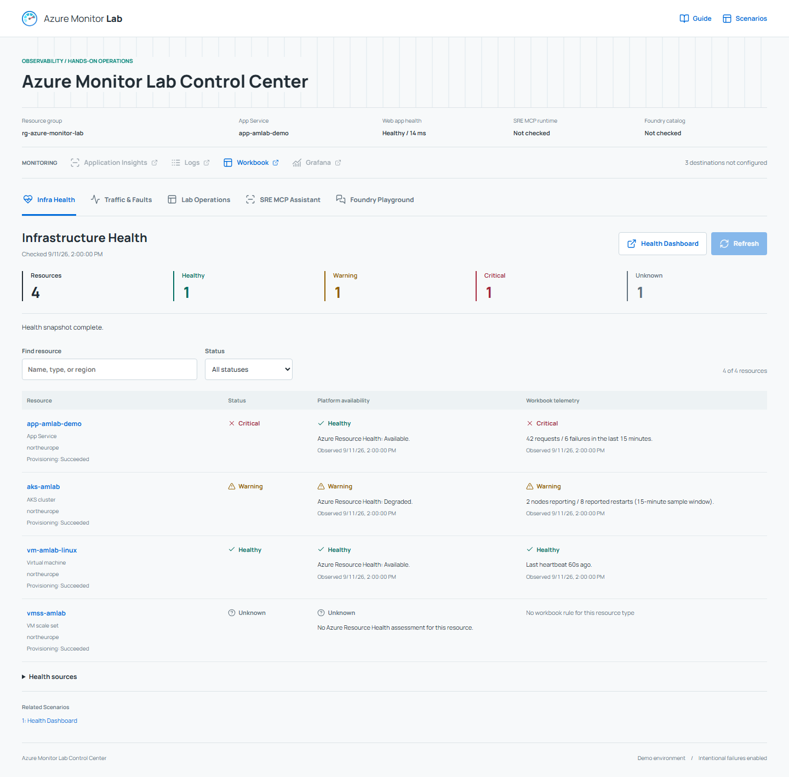
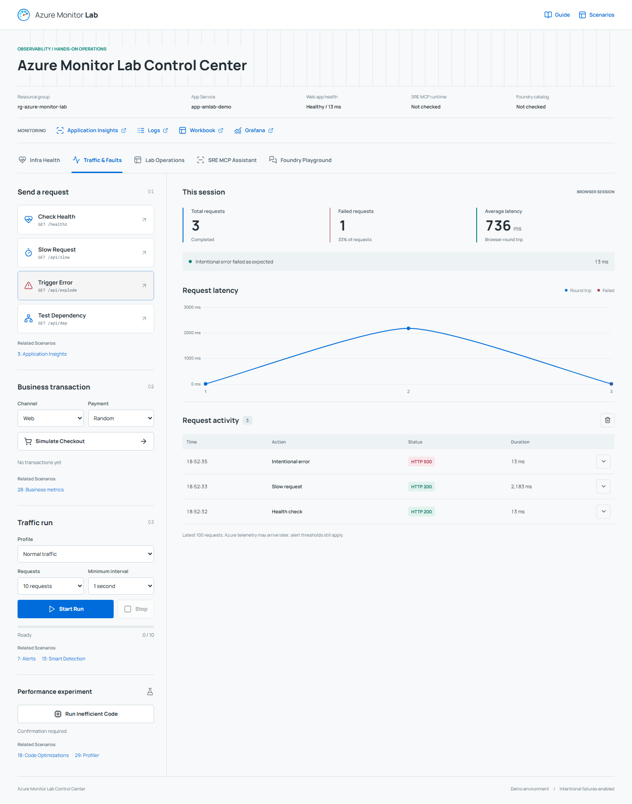
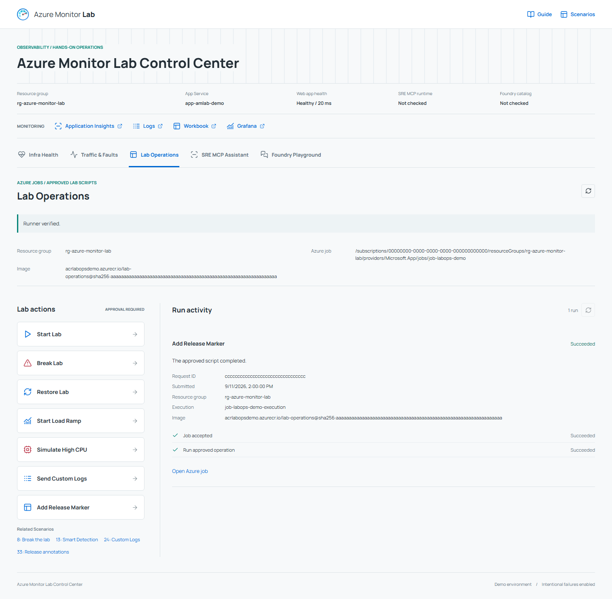

# Azure Monitor Lab Control Center

The Control Center is the operational interface for the Azure Monitor Lab: check infrastructure health, generate application traffic, run approved lab scripts, try the existing Foundry agents, and use direct SRE MCP management tools from the deployed web app. It brings those activities together without replacing the Azure portal or the lab's [guided scenarios](DEMO-SCENARIOS.md).

The screenshots use example resource names, simulated health results, and local test traffic. They are not live health reports.

## Choose Your Starting Point

| Experience | Start here |
|---|---|
| Guided Scenarios | Follow [Demo Scenarios](DEMO-SCENARIOS.md) for the story, prerequisites, portal steps, queries, and expected observations. All existing workflows remain available. |
| Lab Control Center | Open the deployed application to generate activity and interact with the configured agents. Use Related Scenarios links to continue the relevant walkthrough. |

## Open The Application

1. Deploy the lab and complete the [post-deployment steps](POST-DEPLOYMENT.md) for your deployment method. The portal template provisions infrastructure; its Cloud Shell follow-up publishes the application.
2. In the Azure portal, open the lab resource group, select its **App Service**, and choose **Browse**. The app opens at `/` with **Infra Health** selected. **Traffic & Faults** remains available without health or agent access.
3. Check the resource group and App Service shown in the environment strip before sending traffic or approving an operation.
4. For **Infra Health**, **Lab Operations**, **Foundry Playground**, or **SRE MCP Assistant**, select **Sign In** with an approved lab operator account when prompted. Normal deployment configures console sign-in and permissions automatically. Optional agent tabs require their infrastructure stages to be selected.

The Control Center runs in the lab's existing App Service. It is not a separate Azure resource or a replacement for the Azure Resource Manager control plane. For local use, see the [web app developer guide](../workloads/webapp/README.md#run-locally).

## Workspaces

| Tab | Available activities | Requirements |
|---|---|---|
| Infra Health (first/default) | Check only VMs, VM scale sets, AKS clusters, and web apps. Inspect Azure platform availability, VM heartbeats, AKS reporting, and App Service server errors. | Enabled read-only backend access to the lab resource group and central workspace, plus an approved signed-in operator. No AI or SRE stage is required. |
| Traffic & Faults | Health checks, deliberately slow requests and errors, dependency calls, checkout outcomes, bounded traffic runs, and a confirmation-gated performance experiment. Inspect request history, latency, and trace IDs. | The published lab web app. The optional AI and SRE stages are not required. |
| Lab Operations | Start, break, or restore the lab; start the load ramp; simulate high CPU on both demo VMs; send custom logs; add a release marker. Review exact targets and parameters, then track the independent job. | Azure job, pinned image, managed identities, private journal, and operator access, all configured by deployment. CPU simulation requires both VMs running with ready VM Agents. |
| Foundry Playground | Run an approved task against an existing lab agent. Inspect its response, reported model, token usage, run ID, and application trace. | Stage AI and an approved operator. Deployment prepares the four agents and access. |
| SRE MCP Assistant | Ask questions about configured SRE resources and use allowed management tools. Review exact tool arguments before approving a change and inspect the operation log afterward. | Stages AI and SRE Agent, plus an approved operator. Deployment packages MCP and configures host-model access. |

The SRE MCP Assistant does **not** create SRE investigation threads or run autonomous investigations. Its host model selects direct MCP tools. The investigation scenarios remain separate workflows in the SRE portal. Foundry tasks continue to use their existing temporary Foundry threads; that is a different service and workflow.

## Infrastructure Health

The first tab checks the configured lab resource group when opened. **Refresh** requests a new snapshot after the one-minute cache expires; switching tabs does not poll Azure. The time shown is the snapshot time, and individual signals show their observation times. If refresh fails, the previous snapshot stays visible with a warning. The shared **Web app health** field checks `/healthz` automatically on page load and each infrastructure refresh. This independent endpoint check can succeed even when Azure access or telemetry checks fail.

The resource table and status totals include **only virtual machines, VM scale sets, AKS clusters, and web apps**. Workspaces, Application Insights components, App Service plans, storage, networking, and other supporting resources are excluded. The table keeps **platform availability** and **workbook telemetry** separate: a platform-available app can still have critical request failures. No data, inaccessible workspaces, partial queries, and stale platform reports are not silently converted to green.

| Signal | Healthy | Warning | Critical / Unknown |
|---|---|---|---|
| VM heartbeat, last hour | At most 5 minutes old | More than 5, at most 15 minutes old | More than 15 minutes: Critical. No heartbeat within the hour: Unknown. |
| AKS, 15-minute samples | Nodes reporting, at most 5 reported restarts | More than 5 reported restarts | No nodes reporting after a successful query: Critical; query or pod data unavailable: Unknown. |
| App Service HTTP logs, 15 minutes | Requests recorded, no HTTP 5xx | 1-4 HTTP 5xx | At least 5: Critical; no requests: Unknown. |
| Azure Resource Health | Available | Degraded | Unavailable: Critical. No assessment or report older than 30 minutes: Unknown. |

Telemetry thresholds follow the [Health Dashboard workbook](../infra/modules/workbook.bicep). AKS restarts are the workbook's sum of reported per-pod maximum counters in the sample window, not a calculated restart increase. Missing tables, collection delay, intentional failures, and stopped resources can affect results. AKS-managed resources in a separate `MC_` group are outside the inventory scope; node and pod signals still come from this lab's cluster telemetry. VM scale sets use platform availability only, not per-instance telemetry checks, and remain **Unknown** when no current assessment is available.

The tab does not start investigations, use a model, probe arbitrary endpoints, restart resources, or make configuration changes. **Health Dashboard** opens the existing workbook for trends and deeper analysis. See [health access setup](../workloads/webapp/README.md#infrastructure-health).

## Lab Operations

The screenshot uses example configuration and a simulated run. No real operation was executed to produce it.

The seven actions reuse repository scripts through an independent Azure Container Apps Job. Every action requires a five-minute proposal, review of the script, exact lab target and image digest, resource-group confirmation, and approval of changes and charges. The UI shows Azure execution status and links to the job's execution history. Switching away stops automatic status checks, not the job.

**Simulate High CPU** submits fixed 10-minute loads to the Linux and Windows demo VMs without restarting them or using AKS. It validates both tagged targets and their VM Agents first, uses guest overlap locks and expiry, and reports submission rather than confirmed CPU or alert success. Watch **Percentage CPU** for each VM in Azure Monitor; VM health rows here assess heartbeats, not CPU. B-series CPU credits and alert evaluation windows can affect the observed result. Cancellation or Restore Lab does not stop an accepted CPU command. See [CPU simulation details](../workloads/webapp/LAB-OPERATIONS.md#simulate-high-cpu).

**Break Lab is disruptive.** Start and Restore can increase costs, the ramp generates about an hour of load, and ingested events/annotations are not undone by cancellation. Failed scripts can leave partial changes. The app never automatically resends an uncertain dispatch; refresh its status and inspect the resources first.

Normal deployment provisions the registry, environment, image, job, sign-in, roles, and persistent journal automatically. No GitHub credentials or manual enablement are needed. The Web App starts one approved job rather than executing shell commands locally. Deployment prerequisites, delegated runner permissions, costs, and recovery are in the [Lab Operations reference](../workloads/webapp/LAB-OPERATIONS.md).

## Connection Status

The environment strip remains visible across tabs. Statuses reflect the most recent requested check, not continuous monitoring:

- **Resource group / App Service:** deployment context supplied by the backend, not an environment selector.
- **Web app health:** the latest `/healthz` result and response time, checked on page load, infrastructure refresh, and manual health actions. It shows Checking while pending and Unavailable on HTTP, network, or timeout failures. It is not the health of the whole lab.
- **SRE MCP runtime:** checked when its tab opens or its connection is refreshed. Runtime connected means MCP tool discovery succeeded; it does not prove every Azure permission or model call will succeed.
- **Foundry catalog:** checked when its tab opens or its availability is refreshed. An available-agent count means discovery succeeded, not that a task has run.
- **Not checked, Sign-in required, or Unavailable:** no successful check has established availability. Use the status details in the corresponding tab before continuing.

Opening tabs checks availability only; model execution still requires usage consent. Missing services are not provisioned by opening the Control Center.

## From Controls To Scenarios

| Control Center activity | Guided scenario | What to observe |
|---|---|---|
| Infrastructure health snapshot | [1: Health Dashboard](DEMO-SCENARIOS.md#s1) | Resource-scoped availability and workbook-derived traffic lights, including unavailable or stale data. |
| Start, break, and restore lab scripts | [8: Break the lab](DEMO-SCENARIOS.md#s8) | Resource changes and delayed telemetry/alerts after an explicitly approved job. |
| Simulate High CPU | [7: Alerts](DEMO-SCENARIOS.md#s7), [17: Dynamic Thresholds](DEMO-SCENARIOS.md#s17) | Each VM's Percentage CPU, the static CPU alert, and a dynamic baseline when enough history exists. |
| Load ramp, custom logs, and release markers | [13: Smart Detection](DEMO-SCENARIOS.md#s13), [24: Custom Logs](DEMO-SCENARIOS.md#s24), [33: Release annotations](DEMO-SCENARIOS.md#s33) | The corresponding script-driven workload and monitoring evidence. |
| Health, slow, error, and dependency requests | [3: Application Insights](DEMO-SCENARIOS.md#s3) | Server requests, failures, dependencies, and correlated traces. |
| Checkout and payment outcomes | [28: Custom metrics and events](DEMO-SCENARIOS.md#s28) | Business telemetry and checkout outcomes. |
| Controlled traffic and error bursts | [7: Alerts](DEMO-SCENARIOS.md#s7), [13: Smart Detection](DEMO-SCENARIOS.md#s13) | The relationship between generated activity, telemetry, and detection. Follow the scenario's dedicated ramp or threshold requirements where needed. |
| Performance experiment | [18: Code Optimizations](DEMO-SCENARIOS.md#s18), [29: Profiler and Snapshot Debugger](DEMO-SCENARIOS.md#s29) | Profiling and diagnostic evidence after the required traffic and collection interval. |
| Foundry agent tasks | [53: AI FinOps](DEMO-SCENARIOS.md#s53) | Reported model usage, traces, and cost analysis; use the scenario's setup for its full workload. |
| SRE resource, connector, and readiness questions | [54: SRE Agent readiness](DEMO-SCENARIOS.md#s54) | Agent configuration and access prerequisites, without automatically starting an investigation. |
| Open the Workbook or Grafana destination | [1: Traffic-Lights Workbook](DEMO-SCENARIOS.md#s1), [4: Kubernetes and Grafana](DEMO-SCENARIOS.md#s4) | The broader monitoring views in Azure. The Control Center does not replace those dashboards. |

Related Scenarios links are navigation, not execution shortcuts. The [scenario catalog](DEMO-SCENARIOS.md) remains the source of truth for prerequisites and complete click-paths. Browser traffic alone does not guarantee an alert, a Smart Detection incident, or a profiler recommendation; ingestion, sampling, thresholds, and collection time still apply.

## Safety And Access

- Traffic targets the deployed demo application. Errors and delays are intentional; the performance experiment can affect other users of that app. Browser runs are capped at 30 requests, and Stop prevents subsequent requests rather than undoing work already sent.
- Traffic counters and request history include deliberate actions and traffic runs, not automatic header checks. Clearing results preserves the latest header health result and does not delete Azure telemetry.
- Infrastructure health and optional agent access are configured by deployment and require operator-restricted App Service Authentication. Backend service calls use the app's managed identity, not delegated permissions from each browser user.
- Lab Operations has a separate runner identity and single-use script approvals. Cancellation does not undo Azure changes; the ramp and bounded VM CPU loads can keep running after the Azure job completes. VM Run Command access is elevated guest execution scoped to the two demo VMs.
- Foundry tasks and MCP host-model questions require usage consent. Existing model charges apply. Do not submit secrets or sensitive data.
- MCP writes require a separate, expiring approval of the exact tool and arguments. A lost or timed-out response can leave the operation outcome unknown; check Azure before repeating it. Stop Waiting is not a guarantee of cancellation.
- Opening a tab creates no roles or resources. Deployment, not a browser request, configures access. Existing agent API contracts and approval gates are unchanged.

## Setup And Reference

- [Lab deployment options](../README.md#deploy) and [post-deployment steps](POST-DEPLOYMENT.md).
- [Infrastructure health configuration and read-only access](../workloads/webapp/README.md#infrastructure-health).
- [Lab Operations runner configuration, permissions, and recovery](../workloads/webapp/LAB-OPERATIONS.md).
- [Foundry access and developer reference](../workloads/webapp/README.md#enable-foundry-access).
- [SRE MCP configuration, permissions, limits, and recovery](../workloads/webapp/SRE-MCP.md).
- [Complete guided scenarios](DEMO-SCENARIOS.md).

The app's Guide and Scenarios links target the published `master` documentation. When previewing an unmerged feature branch, read this guide from that branch until it is merged. No Azure redeployment is performed by reading the guide.